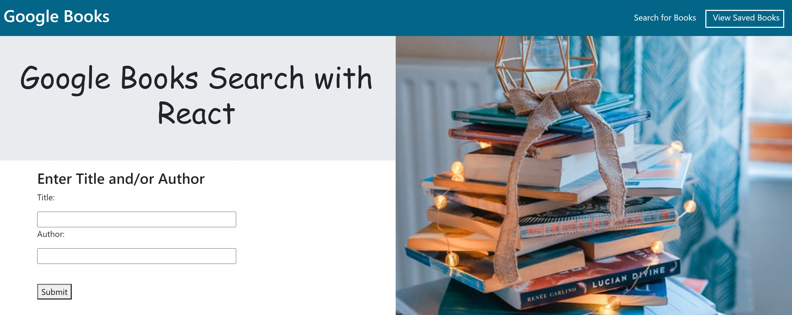
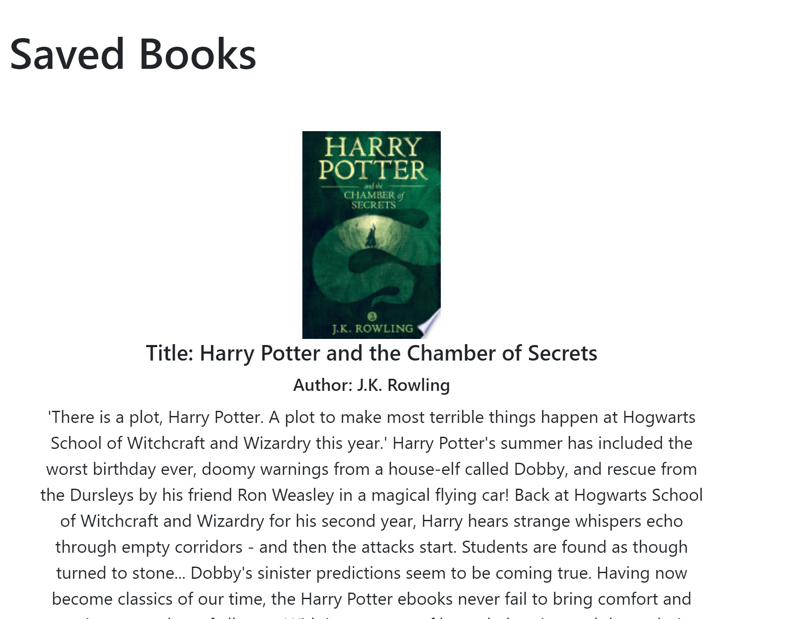

# GoogleBooks

MERN application to search and save books with Google Books API. Check it out: https://react-googlebookss.herokuapp.com/

 

Search for a book by entering Title or Author 

 

Results will show the Title, Author, Description, and link to Google books to purchase. You can also click Save button.

 

Now go to Saved Books

 

You will see your saved book! Here you can click on link to go to Google Books. You can also delete this book off the list.

 

## Technologies Used:
* CSS
* React.js
* Bootstrap
* Google Books API
* MongoDB 

## To Do (as of 3/29/2022):
* More CSS and Bootstrap to style application. 
* Add form validation 
* Update ReadMe